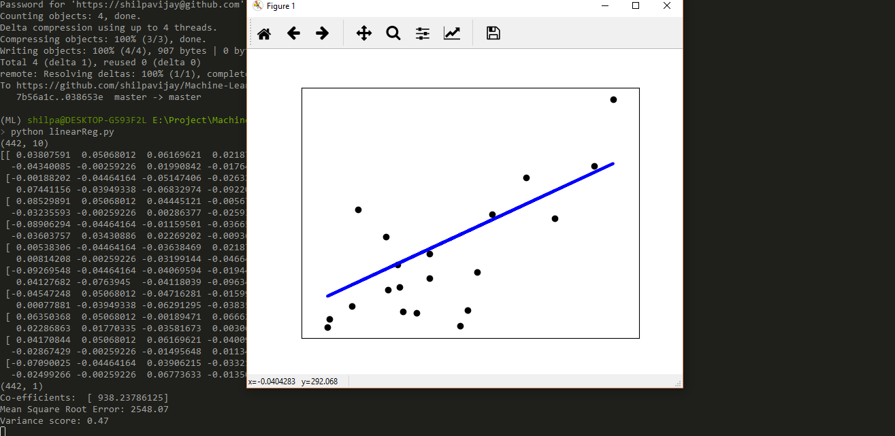

Machine Learning in Python
----------------------------

I am using the scikit-learn library to implement various Machine Learning Algorithms

1. [Linear Regression](Machine-Learning/linearReg.py)

Deep Learning in Python
----------------------------

Implementation of Deep Learning/ Machine Learning concepts in Python

1. [Forward Propogation](Deep-Learning/forwardProp.py)
2. [Implementing Softmax](Deep-Learning/softmax.py)
3. [Artificial Neural Network Prediction Model](Deep-Learning/ann_predict.py)
